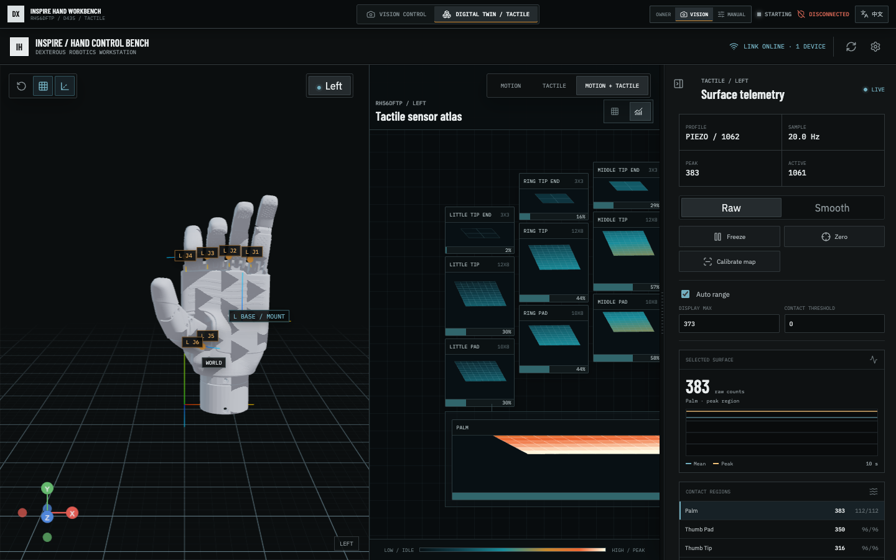
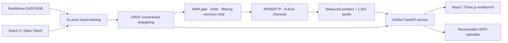

<div align="center">

<p>
  <a href="README.md"></a>
  <a href="README.zh-CN.md"></a>
</p>

<h1>DEX TACTILE</h1>

<p><strong>Vision-to-motion teleoperation and tactile data infrastructure for the Inspire RH56DFTP.</strong></p>
<p>Track a human hand. Retarget through the robot URDF. Guard every hardware write.<br>Inspect motion and 1,062 taxels in one operator workbench.</p>

<p>
  
  
  
  
  
</p>

<p>
  <a href="#quick-start">Quick start</a> ·
  <a href="#control-architecture">Architecture</a> ·
  <a href="#hardware">Hardware</a> ·
  <a href="#d435-dry-run-and-operator-profile-calibration">Teleoperation</a> ·
  <a href="#hand-data-collection">Data collection</a>
</p>

</div>

<p align="center">
  
</p>
<p align="center"><sub>Unified motion and tactile workspace · actual Viewer output · 1,062-taxel frame</sub></p>

Dex Tactile is a research workbench for the Inspire Robots RH56DFTP six-channel dexterous hand
with piezoresistive tactile sensing. It combines D435 RGB hand tracking, URDF-constrained
retargeting, Quest/Open-Teach teleoperation, guarded Modbus TCP control, 2D tactile heatmaps,
3D tactile surface plots, and HDF5 hand-data collection in one repository.

The primary validated setup is a **right-hand RH56DFTP, macOS, one D435, and single-hand
teleoperation**. The device workbench can configure and display both hands, but the current D435
and Quest live-control paths only write to the six channels of the right hand.

## Safety first

> [!CAUTION]
> The dexterous hand can pinch fingers or damage its mechanism. Keep the controller `DISARMED`
> during initial setup, mapping changes, and speed tuning. Complete a dry run first and keep a
> physical power disconnect within reach. The UI E-STOP only commands a software position hold;
> it is not a certified emergency stop, drive-power disconnect, or mechanical limit.

## Quick start

```bash
uv sync --all-groups
cp .env.example .env
cp inspire_visualizer/config/hands.example.json inspire_visualizer/config/hands.json

npm ci --prefix inspire_visualizer/web
npm run build --prefix inspire_visualizer/web
./scripts/run_web.sh
```

Open **http://127.0.0.1:8787/**, keep the controller `DISARMED`, and verify camera, tracking,
six-channel feedback, and tactile status before enabling any hardware output. See
[Software environment](#software-environment) and [Local configuration and privacy](#local-configuration-and-privacy)
for complete setup details.

## Feature status

| Module | Input | Output | Hardware writes |
| --- | --- | --- | --- |
| Unified Web | D435, Modbus, tactile | RGB/keypoints, URDF, joints, 2D/3D tactile views | Only after explicit ARM |
| D435 retargeting | Monocular RGB, 21 MediaPipe landmarks | 12 URDF joints, 6 drive targets | Dry-run or ARM |
| Open-Teach | Quest 3 hand keypoints | Shared RH56 retargeting and 6 drive targets | Dry-run by default |
| Pose scripts | Current motor positions | `home` or `open` preset | Yes |
| Data collection | Tracking, measured positions, 1062 taxels | One HDF5 episode | No |

The six drive channels always use this order:

```text
little_flexion, ring_flexion, middle_flexion, index_flexion,
thumb_flexion, thumb_opposition
```

## Control architecture



The vision and Quest paths share the same robot-space constraints. Modbus ownership is exclusive,
and tracking loss holds the last safe position until valid right-hand tracking returns.

## Repository layout

| Directory | Purpose |
| --- | --- |
| `unified_web/` | Mounts device/tactile and vision-control backends in one FastAPI service |
| `inspire_visualizer/` | Modbus device management, digital twin, tactile sampling, and React workbench |
| `dex-retargeting/` | RH56 URDF, D435 tracking, SomeHand/DexPilot-style constraints, and safety controller |
| `Open-Teach/` | Quest keypoint receiver and RH56DFTP teleoperation adapter |
| `hand_data_collection/` | Read-only, multi-rate, recoverable HDF5 episode recorder |
| `inspire_doc/` | Manufacturer manuals, CAD, URDF, and official communication examples |
| `scripts/` | Stable team entry points; prefer these scripts over module-level commands |
| `docs/` | Design records and implementation notes |

See [THIRD_PARTY.md](THIRD_PARTY.md) for upstream projects, pinned commits, and licenses. The two
complete Open-Teach Unity projects are approximately 1.4 GB and are not stored in the main
repository. Built APKs remain under `Open-Teach/VR/APK/`. Use the upstream commit recorded in
THIRD_PARTY when rebuilding an APK.

## Hardware

### Required

- Inspire Robots RH56DFTP hand with the manufacturer power supply and Ethernet cable
- A macOS or Linux workstation that can join the hand's device subnet
- A physical power disconnect that the operator can reach immediately

### Vision teleoperation

- Intel RealSense D435 connected over USB 3.x
- The current pipeline reads 1280x720 RGB at 30 FPS and does not require a depth stream
- Mount the camera facing the hand workspace and avoid backlight, motion blur, and cropped fingers

### Quest teleoperation (optional)

- Meta Quest 3 with Developer Mode and Hand Tracking enabled
- A USB cable for the initial ADB installation
- A LAN/Wi-Fi network with bidirectional connectivity between the Quest and workstation

The workstation may use wired Ethernet for the RH56 and Wi-Fi for the Quest at the same time. Do
not configure conflicting subnets, and do not assign the workstation the hand's address.

## Software environment

Recommended versions:

- Python `3.11`, pinned by `.python-version`
- [uv](https://docs.astral.sh/uv/) `0.5` or newer
- Node.js `20 LTS` or newer, with npm
- Git; Android Platform Tools (`adb`) is also required to install the Quest APK

Example macOS installation:

```bash
brew install uv node android-platform-tools librealsense jpeg-turbo
```

On Linux, use the official uv installer and the Node.js/ADB packages for your distribution. From
the repository root, install all dependencies and build the unified frontend:

```bash
uv sync --all-groups

npm ci --prefix inspire_visualizer/web
npm run build --prefix inspire_visualizer/web
```

`uv run` automatically uses the root `.venv`; do not install project packages manually with pip.
Frontend dependencies are locked by `inspire_visualizer/web/package-lock.json`. Do not commit
`node_modules/` or `dist/`.

### Optional external-SSD caches

These paths affect only the local machine and must not be committed:

```bash
export UV_CACHE_DIR=/path/to/ssd/cache/uv
export UV_PYTHON_INSTALL_DIR=/path/to/ssd/tools/uv/python
```

Conda is not the Python package manager for this project. If other projects still require Conda,
configure `pkgs_dirs` and `envs_dirs` separately in `~/.condarc`.

## Local configuration and privacy

The repository only uses RFC 5737 documentation addresses from `192.0.2.0/24`; they cannot reach
real devices. Real IP addresses, calibration results, datasets, and logs must remain local.

```bash
cp .env.example .env
cp inspire_visualizer/config/hands.example.json \
  inspire_visualizer/config/hands.json
```

Edit `.env`:

```dotenv
RH56_HOST=YOUR_HAND_IP
RH56_PORT=6000
OPENTEACH_HOST=YOUR_WORKSTATION_IP_VISIBLE_TO_QUEST
D435_CAMERA_SOURCE=avfoundation
D435_CAMERA_INDEX=0
```

Then edit `inspire_visualizer/config/hands.json`:

- Set the connected hand to `enabled: true` and the other hand to `false`.
- Set `host` to the corresponding device IP. Left and right hands must use different endpoints.
- Use `piezoresistive_v1` for RH56DFTP piezoresistive tactile sensing.
- Use `disabled` when tactile sensing is unavailable or not needed.

Root scripts load `.env` automatically. These local artifacts are excluded by `.gitignore`:

```text
.env
inspire_visualizer/config/hands.json
inspire_visualizer/config/tactile_calibration.json
dex-retargeting/viewer/config/retargeting-calibration.json
dex-retargeting/viewer/config/operator-profiles.json
datasets/
*.partial.h5
*.log
```

Do not put real names, account identifiers, laboratory IPs, Wi-Fi details, or participant identity
in issues, pull requests, screenshots, or the HDF5 `--task`/`--operator` fields. The default
operator is `anonymous`; use a team-defined anonymous identifier when operators must be separated.

`inspire_doc/` preserves manufacturer reference files verbatim. Private-network addresses inside
that directory are manufacturer examples, not laboratory configuration. Do not write local values
back into those files. Generated ROS `build/`, `install/`, and `log/` directories are not tracked.

## Network checks

1. Configure a static workstation address in the RH56 subnet according to the manufacturer manual.
2. Confirm that the workstation address does not conflict with the device.
3. Test connectivity before starting a control process:

```bash
ping YOUR_HAND_IP
nc -vz YOUR_HAND_IP 6000
```

The Quest path requires at least port `8087` on the workstation for incoming keypoints. Open-Teach
also configures `8088-8093`, `8095`, `8100-8102`, `8110-8121`, `10005`, `10010`, and `15001`.
When a firewall is enabled, expose only the ports enabled in `Open-Teach/configs/network.yaml`, and
only to a trusted LAN.

## Start the unified workbench

Build the unified frontend, then run:

```bash
./scripts/run_web.sh
```

On macOS, the default path opens the D435 RGB UVC endpoint through AVFoundation. It does not need
`sudo` or raw librealsense USB access. Before startup, allow the current terminal under System
Settings > Privacy & Security > Camera. `D435_CAMERA_INDEX=0` selects the first enumerated video
device; recheck the index after connecting Continuity Camera or another webcam.

The native librealsense bridge remains an explicit experimental option for environments with raw
USB access:

```bash
./scripts/run_realsense_bridge.sh
D435_BRIDGE_EXTERNAL=1 ./scripts/run_web.sh
```

If AVFoundation only exposes a D435 endpoint containing `Depth` in its name, the frames may be
infrared and unsuitable for the current MediaPipe RGB tracker. Select an endpoint containing
`RGB Module RGB` only after confirming that it produces color frames.

The server listens on `127.0.0.1:8787` by default:

```text
http://127.0.0.1:8787/
```

Health checks:

```bash
curl http://127.0.0.1:8787/api/health
curl http://127.0.0.1:8787/vision/api/health
```

To allow another computer on the same trusted LAN to connect:

```bash
./scripts/run_web.sh --host 0.0.0.0 --port 8787
```

The service currently has no authentication. Never expose it to the public internet. The workbench
contains:

- `VISION CONTROL`: D435 RGB/keypoint modes, handedness detection, URDF pose, 12 joints, and 6 targets
- `DIGITAL TWIN`: online state, measured/target angles, and coordinate frames for configured hands
- `TACTILE`: 17 anatomically arranged 2D regions, a color heatmap, and a 3D surface plot
- English/Chinese switching while preserving engineering identifiers in English

The device workbench identifies left and right hands by configured slots because the RH56 protocol
does not provide a reliable read-only handedness field. A hand is displayed only after a successful
connection and valid angle feedback.

### D435 dry run and operator Profile calibration

1. Keep the controller `DISARMED`.
2. Place the complete right hand in the RGB frame and verify `TRACKING`, 21 landmarks, and continuous
   six-channel targets.
3. Test opening, closing, isolated finger flexion, four fingertip pinches, and a tripod pinch.
4. While `DISARMED`, create or select an operator under `Operator profile` at the top of the Viewer.
5. Open Profile management and select `Calibrate`.
6. Follow the guided open, relaxed, fist, thumb-opposition, and OK-pinch poses. Hold each pose steady;
   the Viewer collects 30 valid samples and advances automatically.

A Profile maps an operator's finger-flexion, thumb-opposition, and pinch-distance ranges into the
RH56 URDF workspace. Switching Profile clears the vision EMA and contact latch without sending a
hardware position. Profile creation, switching, import, deletion, and calibration are allowed only
while `DISARMED`. A failed pose can be retried without restarting the full calibration.

Profiles are stored locally in `dex-retargeting/viewer/config/operator-profiles.json` and can be
imported/exported as anonymous JSON. On first startup, legacy `retargeting-calibration.json` data is
migrated into a `Legacy calibration` Profile; the source file is retained.

Deterministic gesture diagnostics:

```bash
cd dex-retargeting
uv run --project .. python -m viewer.tools.retargeting_diagnostics
uv run --project .. python -m viewer.tools.retargeting_diagnostics \
  --live-seconds 20 \
  --output viewer/debug/retargeting-session.jsonl
cd ..
```

### D435 live teleoperation

1. Clear the hand workspace and confirm that no other process is connected to Modbus.
2. While `DISARMED`, verify valid feedback from all six channels.
3. Maintain stable right-hand tracking, click `ARM`, and review the measured and visual target values
   in the confirmation dialog.
4. The controller reads the current position first, then approaches the vision target through
   clamping, filtering, and speed limits.
5. Brief or sustained tracking loss enters `RECOVERY HOLD`. Control resumes automatically after
   right-hand tracking returns; re-arming is not required.
6. Click `DISARM` when finished. Use E-STOP on abnormal behavior and remove physical power if needed.

The controller always starts `DISARMED`. Only `ARMED` and `POSITIONING` states write Modbus targets.

## Fixed poses

The Viewer is optional. A pose script uses a healthy, `DISARMED` Viewer when available; otherwise it
connects to Modbus directly:

```bash
./scripts/go_pose.sh open
./scripts/go_pose.sh home
```

- `open`: `[1000, 1000, 1000, 1000, 1000, 1000]`
- `home`: `[120, 120, 120, 120, 180, 480]`

The script reads the measured position first and uses conservative preset steps and speeds.
`Ctrl+C` attempts to hold the current position. If the Viewer port is occupied but unresponsive,
the script refuses a direct fallback to prevent two controllers with unknown state from writing.

## Quest / Open-Teach teleoperation

### 1. Install the APK

Enable Developer Mode and Hand Tracking on the Quest, connect USB, then run:

```bash
adb devices
adb install -r Open-Teach/VR/APK/SingleArmBot.apk
```

`adb devices` should show a serial with status `device`. For `unauthorized`, accept the USB debugging
prompt inside the headset.

### 2. Configure Quest networking

1. Set `OPENTEACH_HOST` in `.env` to a workstation LAN address reachable from the Quest.
2. In the sideloaded Quest app, choose `Change IP` and enter the same address.
3. Enable Stream. A green border means the app is sending keypoints; it does not enable robot writes.
4. After the black hand mask/keypoints and test object appear, start the workstation dry run.

### 3. Dry run

```bash
./scripts/run_openteach.sh
```

The default `dry_run: true` receives the Quest 24-point skeleton, applies RH56 URDF retargeting, and
records six-channel targets without connecting to or writing the hand. Test four-finger flexion,
thumb flexion/opposition, and pinching individually before live control.

### 4. Live control

Stop the unified Viewer completely so that only one Modbus writer remains, then run:

```bash
./scripts/run_openteach.sh --live
```

Open-Teach uses the same URDF-constrained retargeting as the D435 path, with adaptive steps, speed
limits, and output filtering in a 30 Hz loop. Stop with `Ctrl+C`. Remove physical power immediately
if the hand continues moving or the process becomes unresponsive.

## Tactile sensing

The RH56DFTP uses piezoresistive tactile sensors. The current implementation reads 17 regions with
1062 taxels at a target rate up to 20 Hz; complete Modbus frames are usually slightly slower.

- 2D regional heatmap: arranged like a palm and fingers for contact localization
- 3D surface plot: uses both color and height to show relative pressure distribution
- `Zero`: records approximately one second of median data as a browser baseline; it does not change
  calibration inside the hand

Values are raw counts and cannot be interpreted directly as N or Pa. The 2D layout describes array
topology, not exact CAD positions of manufacturer electrodes. Precise physical mapping requires a
manufacturer table containing each taxel's identifier, 3D center, normal, active area, owning link,
and coordinate-frame definition.

## Hand-data collection

Version 1 records hand numerical data only; it does not save RGB, depth, or robot-arm data. One
command creates one right-hand episode:

```bash
./scripts/record_hand.sh \
  --task "index-thumb-pinch" \
  --operator "operator-01" \
  --duration 60
```

Without `--duration`, press `Ctrl+C` to finalize the file atomically. Output defaults to
`datasets/hand/`.

Common options:

```text
--output PATH
--source auto|viewer|standalone
--viewer-url http://127.0.0.1:8787
--startup-timeout 30
```

- `auto`: reuse a healthy unified Viewer, otherwise start a read-only standalone pipeline
- `viewer`: require both device and vision health checks to pass
- `standalone`: read D435, measured positions, and tactile data independently; it has no ARM API and
  does not write Modbus targets

Recording begins only when the right hand is `TRACKING`, all six measured channels are online, the
right tactile profile is `piezoresistive_v1`, and a complete 1062-taxel frame has arrived. Brief
tracking loss does not end the episode; tracking fields become NaN/invalid while robot and tactile
streams continue.

### HDF5 v1 schema

| Group | Rate | Contents |
| --- | --- | --- |
| `/frames` | 30 Hz | 21 2D/3D landmarks, 12 URDF joints, 6 targets, contact/control state |
| `/robot` | About 5 Hz | Six measured positions, connection state, and armed state |
| `/tactile` | Up to 20 Hz | 17 regions and 1062 `uint16` raw counts |
| `/events` | Event-driven | Tracking transitions, invalid frames, start/stop reasons |

Files use `.partial.h5` during recording and are atomically renamed to `.h5` after a normal stop. An
abnormal exit retains the partial file with `complete=false` to prevent accidental use.

Quick inspection:

```bash
uv run python -c '
import h5py, sys
with h5py.File(sys.argv[1], "r") as f:
    print(dict(f.attrs))
    print("frames", len(f["frames/time/elapsed"]))
    print("robot", len(f["robot/time/elapsed"]))
    print("tactile", len(f["tactile/time/elapsed"]))
' datasets/hand/YOUR_EPISODE.h5
```

HDF5 is the canonical format because the source is compressed, multi-rate numerical data. Its
semantics can map to LeRobot: `robot/actual` to `observation.state`, targets/commands to `action`,
and keypoints/tactile to custom observations. Add a LeRobot v3 exporter when policy training or
Hugging Face Hub publishing becomes necessary.

## Development and verification

Backend checks:

```bash
uv run ruff check hand_data_collection inspire_visualizer/backend unified_web scripts/tests \
  dex-retargeting/viewer dex-retargeting/src/dex_retargeting/inspire_retargeting.py
uv run pyright
uv run pytest -q

uv run pytest -q dex-retargeting/viewer/backend/tests
uv run pytest -q Open-Teach/tests
```

Frontend checks:

```bash
npm test --prefix inspire_visualizer/web -- --run
npm run typecheck --prefix inspire_visualizer/web
npm run build --prefix inspire_visualizer/web
```

Standalone frontend development server:

```bash
npm run dev --prefix inspire_visualizer/web
```

Never run multiple live-control backends against the same hand. Frontend development may connect to
the unified backend, but only one controller may own Modbus writes.

## Team workflow

1. Develop on short-lived feature branches and merge through pull requests.
2. Do not modify manufacturer originals under `inspire_doc/`; put derived conclusions in project
   documentation or code.
3. Do not commit `.env`, `hands.json`, personal calibration, datasets, logs, screenshot addresses,
   or absolute local paths.
4. Include automated tests and a dry-run gesture matrix with algorithm changes.
5. For Modbus, speed, force, or pose changes, document the hand model, validation procedure, and
   safety boundaries in the PR, but never the device IP.
6. Preserve upstream licenses when modifying third-party directories and update
   [THIRD_PARTY.md](THIRD_PARTY.md).
7. Run `git status --ignored` before committing and verify that local configuration and data remain
   ignored.

Suggested pull-request template:

```text
Summary:
Risk / hardware impact:
Tests:
Dry-run evidence:
Physical verification (if any):
Rollback:
```

## Troubleshooting

### Viewer starts without a camera image

- Confirm that the D435 uses USB 3.x and is visible to the operating system.
- Enumerate AVFoundation endpoints and select one containing `RGB Module RGB`.
- Confirm `D435_CAMERA_SOURCE=avfoundation` and the current camera index in `.env`.
- Allow the terminal under System Settings > Privacy & Security > Camera.
- Use `D435_CAMERA_ROTATION=90`, `180`, or `270` for clockwise installation correction.
- AVFoundation indexes can change when Continuity Camera or another webcam is connected.
- `RS2_USB_STATUS_ACCESS` concerns raw librealsense USB access, not AVFoundation camera permission;
  the default macOS path does not depend on it.

### `DISCONNECTED` or Modbus timeout

- Confirm that `.env` and `hands.json` refer to the same device.
- Run `ping` and `nc -vz`; inspect the static address, subnet mask, and firewall.
- Confirm that no Viewer, Open-Teach process, or pose script already owns the same device.

### Quest shows hands but the workstation receives no keypoints

- The Quest must use `OPENTEACH_HOST`, not the dexterous-hand IP.
- Confirm network reachability to the selected workstation interface and check port `8087`.
- Start `./scripts/run_openteach.sh` in dry-run before debugging the hardware path.

### Data collection remains at `Waiting for data`

The log reports `tracking`, `robot`, and `tactile` separately. All three must be `ok` before writing
an episode. Keep the right hand visible, confirm that the device is online, and enable
`piezoresistive_v1` in `hands.json`.

### Brief tracking loss

Live control enters `RECOVERY HOLD` and waits for tracking to return. Data collection continues with
invalid tracking frames. Do not wait for software recovery after abnormal mechanical motion; use
E-STOP or remove physical power immediately.
