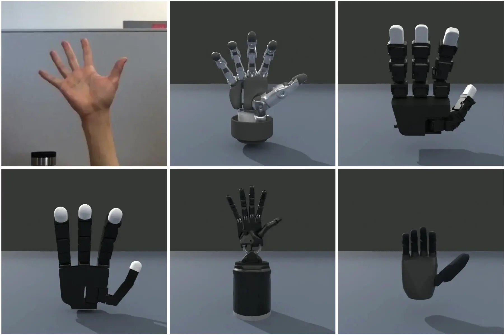
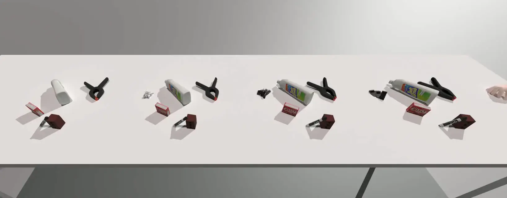

<div align="center">
  <h1 align="center"> Dex Retargeting </h1>
  <h3 align="center">
    Various retargeting optimizers to translate human hand motion to robot hand motion.
  </h3>
</div>
<p align="center">
  <!-- code check badges -->
  <a href='https://github.com/dexsuite/dex-retargeting/blob/main/.github/workflows/test.yml'>
      
  </a>
  <!-- issue badge -->
  <a href="https://github.com/dexsuite/dex-retargeting/issues">
  
  </a>
  <a href="https://github.com/dexsuite/dex-retargeting/issues?q=is%3Aissue+is%3Aclosed">
  
  </a>
  <!-- release badge -->
  <a href="https://github.com/dexsuite/dex-retargeting/tags">
  
  </a>
  <!-- pypi badge -->
  <a href="https://github.com/dexsuite/dex-retargeting/tags">
  
  </a>
  <!-- license badge -->
  <a href="https://github.com/dexsuite/dex-retargeting/blob/main/LICENSE">
      
  </a>
</p>
<div align="center">
  <h4>This repo originates from <a href="https://yzqin.github.io/anyteleop/">AnyTeleop Project</a></h4>
  
</div>

## Installation

```shell
pip install dex_retargeting
```

To run the example, you may need additional dependencies for rendering and hand pose detection.

```shell
git clone https://github.com/dexsuite/dex-retargeting
cd dex-retargeting
pip install -e ".[example]"
```

### Install with uv

This repository pins Python 3.11 for a reproducible local environment. Install the
core package and development tools with:

```shell
uv sync --extra dev
```

Run commands inside the managed environment with `uv run`, for example:

```shell
uv run pytest
uv run ruff check src tests
```

Install the optional rendering and hand-detection dependencies only when needed:

```shell
uv sync --extra dev --extra example
```

On macOS ARM64, uv installs the MediaPipe/OpenCV examples but skips SAPIEN because
SAPIEN 3.0.0b0 does not publish a compatible wheel. Run the SAPIEN rendering examples
on Linux x86_64 or Windows x86_64. MediaPipe is constrained below 0.10.30 because
the examples use its legacy Solutions API, which newer releases removed.

### D435 vision retargeting viewer

The standalone viewer uses D435 RGB camera index 0 to track a right hand, retarget
21 MediaPipe landmarks to the 12-DOF Inspire URDF, and control six RH56DFTP drive
channels through guarded Modbus output. Startup is always `DISARMED`; connecting or
reconnecting reads the hand position but never writes a motion command.

The Viewer uses a six-variable constrained solver tailored to the Inspire coupling
model. It optimizes the four finger flexion joints plus thumb flexion and opposition,
then expands the result to the 12 URDF joints through the model's mimic constraints.
The objective matches 11 human/robot finger-segment directions, the thumb CMC frame,
and an exclusive thumb-to-fingertip contact target. Contact uses DexPilot-style
hysteresis: the nearest finger locks below 30 mm, remains selected until it exceeds
50 mm, and projects that robot fingertip pair toward a 5 mm target. Drive commands
are mapped directly from the six independent joints instead of averaging the
expanded 12-joint pose. This formulation is based on the constraint strategy used by
[SomeHand](https://github.com/BotRunner64/somehand), adapted to the existing
Pinocchio/NLopt runtime and RH56DFTP protocol.

On macOS, allow camera access for the terminal before launching. Install and build:

```shell
uv sync --extra dev --extra example --extra viewer
cd viewer/web
npm install
npm run build
cd ../..
```

Start the unified vision, digital-twin, and tactile workbench from the repository
root:

```shell
cd ..
./scripts/run_web.sh
```

Open `http://127.0.0.1:8787/` and select `VISION CONTROL`. Present the right hand
to the mirrored RGB image. The vision API is namespaced under `/vision/api` in the
unified server; direct `python -m viewer.run` remains available for isolated
development.
ARM is enabled only during fresh right-hand tracking. The confirmation dialog shows
the measured and vision positions; control starts from the measured position and
slews toward the target at 30 Hz using the Open-Teach aggressive motion profile.

Tracking loss, a stale frame, wrong-hand classification, or camera interruption
immediately writes the measured position as a hold target and keeps the ARM session
in `RECOVERY HOLD`. Fresh right-hand tracking resumes automatically from the
measured position through the normal motion limits, regardless of interruption
duration. Manual DISARM, E-STOP, a Modbus failure, or a malformed actuator target
ends the session; E-STOP latches `ESTOPPED` until RESET. This is a software position
hold, not a certified hardware emergency stop or torque-off. Keep physical power
removal accessible and clear the hand's workspace before ARM.

Run the deterministic gesture matrix after retargeting changes:

```shell
uv run python -m viewer.tools.retargeting_diagnostics
```

It checks open, fist, point, victory, thumbs-up, hook grasp, tabletop, isolated
natural and MCP-only curls, all four thumb-finger pinches, and a tripod pinch. For
read-only D435 telemetry capture, keep the controller DISARMED, present the right
hand, and run:

```shell
uv run python -m viewer.tools.retargeting_diagnostics \
  --live-seconds 20 \
  --output viewer/debug/retargeting-session.jsonl
```

The summary reports tracking states, FPS, latency, confidence, per-channel ranges,
per-finger flexion ranges, contact selections, and whether Modbus output was ever
observed. A run without tracked frames exits with status 2.

Before the first live session, keep control DISARMED, hold the fully open right hand
in fresh tracking, and collect the 30-frame neutral pose:

```shell
curl -X POST \
  -H 'X-RH56-Control: operator-confirmed' \
  http://127.0.0.1:8787/vision/api/retargeting/calibration/open
curl http://127.0.0.1:8787/vision/api/retargeting/calibration
```

Calibration removes the D435/MediaPipe open-hand angle bias from all six targets.
The result is stored locally in `viewer/config/retargeting-calibration.json` and is
restored on the next Viewer start; this operator-specific file is ignored by Git.

Run frontend development separately with `npm run dev` from `viewer/web`; Vite
proxies API and asset requests to port 8787.

To move the connected hand to a fixed preset, first start the Viewer, confirm its
control state is `DISARMED`, and clear the hand's workspace. Use the single pose
command with either `home` or `open`:

```shell
../scripts/go_pose.sh home
../scripts/go_pose.sh open
```

The calibrated Home target is `[120, 120, 120, 120, 180, 480]`; Open is
`[1000, 1000, 1000, 1000, 1000, 1000]`. Channel order is little, ring, middle,
index, thumb-bend, and thumb-rotation. The command calls only guarded fixed-preset
Viewer APIs and waits for `DISARMED`; it does not open a second Modbus connection.
Preset completion allows up to 15 counts of measured-position tolerance because
the RH56 full-open feedback can settle near `987..1000`; command targets remain
unchanged and the adaptive motion deadband remains 8 counts. Home/Open use the
reduced preset profile with per-cycle steps `[15, 40, 80]` and speed values
`[80, 180, 300]`; vision control uses `[20, 60, 120]` and `[100, 260, 450]`.
The thumb-yaw channel applies a calibrated `2.0x` response multiplier, producing
steps `[40, 120, 240]` and speeds `[200, 520, 900]`; the other five channels keep
the base profile.
For a Viewer on another host or port, set `RH56_VIEWER_URL`, for example:

```shell
RH56_VIEWER_URL=http://192.0.2.20:8787/vision ../scripts/go_pose.sh open
```

Preset positioning is a software move and hold, not a certified safety stop. Keep
physical power removal accessible while the hand is moving.

The Viewer is optional for preset commands. If the local Viewer is reachable and
`DISARMED`, the command uses its guarded API. If the Viewer port explicitly refuses
the connection, the command connects directly to `RH56_HOST:RH56_PORT`, reads the
actual hand position, and runs the same bounded controller without starting the
camera. A Viewer port that accepts a connection but times out does not trigger
direct fallback, because its controller state is ambiguous. In direct mode,
`Ctrl+C` holds the measured position before disconnecting; physical power removal
remains the final safety action. Local Viewer health requests bypass inherited
`http_proxy`, `https_proxy`, and `all_proxy` settings so a desktop proxy cannot be
mistaken for a running Viewer.

## Changelog

### v0.5.0

- **Numpy Support Update**: Starting from this version, `dex-retargeting` supports `numpy >= 2.0.0`. If you need to use `numpy < 2.0.0`, you can install an earlier version of `dex-retargeting` using:
  ```bash
  pip install "dex-retargeting<0.5.0"
  ```

- **Mediapipe Compatibility**: Although `mediapipe` lists `numpy 1.x` as a dependency, it is compatible with `numpy >= 2.0.0`. You can safely ignore any warnings related to this and continue using `numpy 2.0.0` or higher.

- **Dependency Cleanup**: Removed `trimesh` as a dependency to simplify installation and reduce potential conflicts. The core functionality of `dex-retargeting` no longer requires mesh processing capabilities.

## Examples

### Retargeting from human hand video

This type of retargeting can be used for applications like teleoperation,
e.g. [AnyTeleop](https://yzqin.github.io/anyteleop/).

[Tutorial on retargeting from human hand video](example/vector_retargeting/README.md)

### Retarget from hand object pose dataset



This type of retargeting can be used post-process human data for robot imitation,
e.g. [DexMV](https://yzqin.github.io/dexmv/).

[Tutorial on retargeting from hand-object pose dataset](example/position_retargeting/README.md)

## FAQ and Troubleshooting

### Joint Orders for Retargeting

URDF parsers, such as ROS, physical simulators, real robot driver, and this repository, may parse URDF files with
different joint orders. To use `dex-retargeting` results with other libraries, handle joint ordering explicitly **using
joint names**, which are unique within a URDF file.

Example: Using `dex-retargeting` with the SAPIEN simulator

```python
from dex_retargeting.seq_retarget import SeqRetargeting

retargeting: SeqRetargeting
sapien_joint_names = [joint.get_name() for joint in robot.get_active_joints()]
retargeting_joint_names = retargeting.joint_names
retargeting_to_sapien = np.array([retargeting_joint_names.index(name) for name in sapien_joint_names]).astype(int)

# Use the index map to handle joint order differences
sapien_robot.set_qpos(retarget_qpos[retargeting_to_sapien])
```

This example retrieves joint names from the SAPIEN robot and `SeqRetargeting` object, creates a mapping
array (`retargeting_to_sapien`) to map joint indices, and sets the SAPIEN robot's joint positions using the retargeted
joint positions.

## Citation

This repository is derived from the [AnyTeleop Project](https://yzqin.github.io/anyteleop/) and is subject to ongoing
enhancements. If you utilize this work, please cite it as follows:

```shell
@inproceedings{qin2023anyteleop,
  title     = {AnyTeleop: A General Vision-Based Dexterous Robot Arm-Hand Teleoperation System},
  author    = {Qin, Yuzhe and Yang, Wei and Huang, Binghao and Van Wyk, Karl and Su, Hao and Wang, Xiaolong and Chao, Yu-Wei and Fox, Dieter},
  booktitle = {Robotics: Science and Systems},
  year      = {2023}
}
```

## Acknowledgments

The robot hand models in this repository are sourced directly from [dex-urdf](https://github.com/dexsuite/dex-urdf).
The robot kinematics in this repo are based on [pinocchio](https://github.com/stack-of-tasks/pinocchio).
Examples use [SAPIEN](https://github.com/haosulab/SAPIEN) for rendering and visualization.

The `PositionOptimizer` leverages methodologies from our earlier
project, [From One Hand to Multiple Hands](https://yzqin.github.io/dex-teleop-imitation/).
Additionally, the `DexPilotOptimizer`is crafted using insights from [DexPilot](https://sites.google.com/view/dex-pilot).
